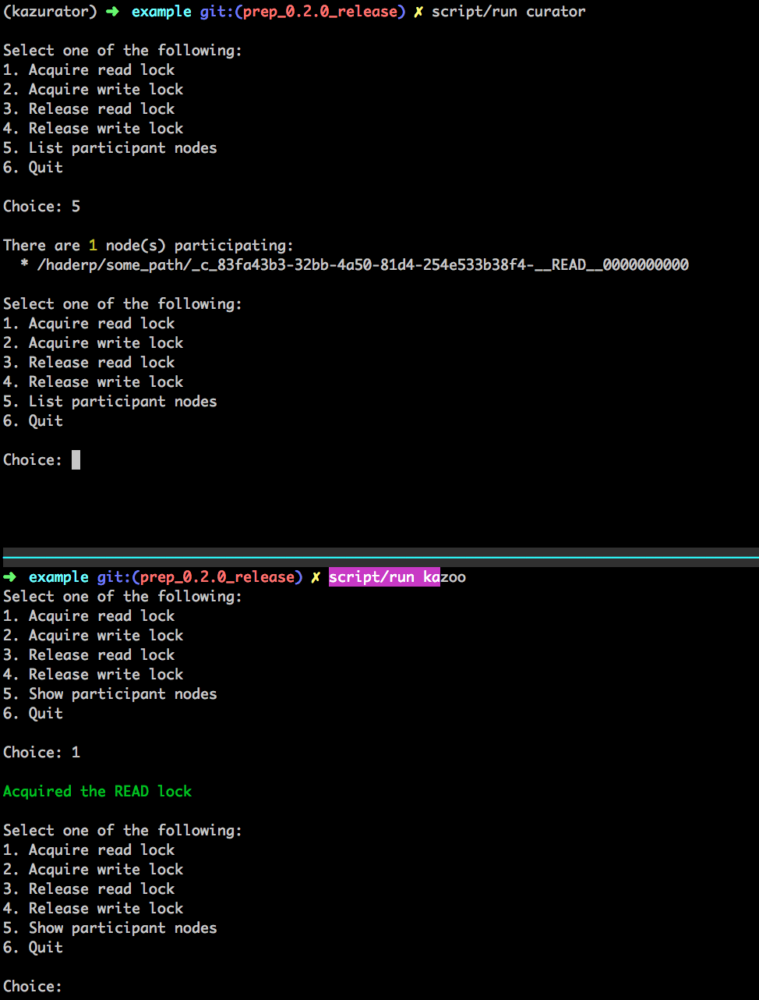

# Kazurator Example

This is a little test bed application that you can you to test out the interop between curator and kazoo.

## Dependencies

In order to run this, you'll need a couple of things available on the PATH:

* [Docker-Compose](https://docs.docker.com/compose/)
* [Scala Build Tool (sbt)](http://www.scala-sbt.org/)

## Running the Example

This all assumes the current working directory is ./example.

* Run `script/setup`. This will build the scala uberjar, the python wheel, and all the docker containers.
* Run `script/run curator` to launch the curator driver
* In another terminal, run `script/run kazoo` to launch the kazoo driver

Each of the drivers has a menu that allows you to acquire/release read/write locks and show existing lock nodes that are
participating in the lock.

When you're done, run `script/setup teardown` to clean everything up.

## Things to Verify

**Kazoo blocks appropriately**

* Acquire the read lock with curator
* Attempt to acquire the write lock with kazoo (should block)
* Release the read lock with curator
* Kazoo should now have the write lock

* Acquire the write lock with curator
* Attempt to acquire the read lock with kazoo (should block)
* Release the write lock with curator
* Kazoo should now have the read lock

**Curator blocks appropriately**

* Acquire the read lock with kazoo
* Attempt to acquire the write lock with curator (should block)
* Release the read lock with kazoo
* Curator should now have the write lock

* Acquire the write lock with kazoo
* Attempt to acquire the read lock with curator (should block)
* Release the write lock with kazoo
* Curator should now have the read lock
